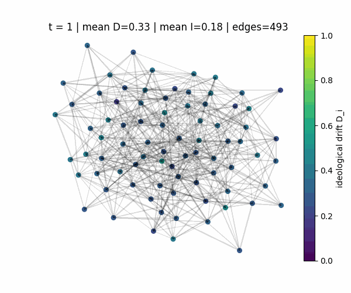

# Modeling the Male Loneliness Epidemic via Social Networks and Algorithmic Exposure

Agent-based Monte Carlo simulation of a feedback loop between social isolation, recommendation systems, ideological drift, and friendship decay among young men.

## Files

- [CS166_final_codebook.ipynb](CS166_final_codebook.ipynb): simulation code, experiments, plots, and confidence intervals
- [CS166_final_report_with_figures.pdf](CS166_final_report_with_figures.pdf): final written report with figures and interpretation
- [simulation.gif](simulation.gif): animated view of the network dynamics over time

## Summary

The model represents each person as a node in a weighted friendship network. Isolation increases the probability of harmful algorithmic exposure, exposure increases ideological drift, and disagreement weakens friendships. The project compares interventions that reduce algorithmic amplification and strengthen social support.

